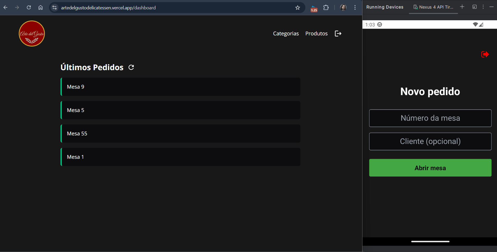

# **Arte Del Gusto - Front-End**

[](https://nextjs.org/)
[](https://www.typescriptlang.org/)
[](https://tailwindcss.com/)
[](https://vercel.com/)
[](https://opensource.org/licenses/MIT)

## 💡 Sobre
Este repositório contém o **Front-End (Painel Web)** para o sistema de gerenciamento da delicatessen **Arte Del Gusto**. Desenvolvido com **Next.js** e **TypeScript**, esta aplicação web serve como a interface administrativa central, permitindo o gerenciamento eficiente de pedidos, produtos e categorias.

O painel web oferece uma experiência de usuário fluida e responsiva, integrando-se diretamente com a [API Back-End](https://github.com/Antonio-Savio/Arte-del-Gusto-back-end) para buscar e manipular dados. Ele também complementa o [Aplicativo Móvel](https://github.com/Antonio-Savio/Arte-del-Gusto-mobile), que é usado pela equipe para registrar os pedidos iniciais, os quais são então gerenciados neste painel.

---

## 🌐 Sistema em funcionamento
- Demonstração da aplicação web sendo executada junto ao aplicativo móvel:



---

## 🔗 Links da aplicação
- [Deploy front-end](https://artedelgustodelicatessen.vercel.app)
- [Repositório back-end](https://github.com/Antonio-Savio/Arte-del-Gusto-back-end)
- [Repositório mobile](https://github.com/Antonio-Savio/Arte-del-Gusto-mobile)

---

## ✅ Funcionalidades Principais e Destaques
*   **Autenticação Segura com JWT:** Implementa login de usuário utilizando tokens JWT fornecidos pela API, armazenados de forma segura em cookies.
*   **Proteção de Rotas com Middleware:** Utiliza o middleware do Next.js (`middleware.ts`) para controlar o acesso a rotas privadas (dashboard), redirecionando usuários não autenticados.
*   **Integração com Fluxo Móvel:** Projetado para gerenciar pedidos criados pelo [aplicativo móvel](https://github.com/Antonio-Savio/Arte-del-Gusto-mobile). O botão de atualização (**⟳**) no dashboard busca novos pedidos da API.
*   **Painel Administrativo Abrangente:**
    *   **Dashboard de Pedidos:** Visão geral e em tempo real (com atualização manual) dos pedidos em aberto recebidos da API.
    *   **Gerenciamento de Produtos:** CRUD para produtos, incluindo upload de imagens (interagindo com a API).
    *   **Gerenciamento de Categorias:** Criação e exclusão de categorias de produtos.
*   **Modal Interativo de Detalhes do Pedido:** Permite visualizar os itens, calcular o valor total e concluir um pedido diretamente da interface.
*   **Formatação de Moeda:** Funções utilitárias (`src/utils`) para formatar valores monetários para o padrão brasileiro (BRL).
*   **Interface Responsiva:** Design adaptável a diferentes tamanhos de tela utilizando Tailwind CSS.
*   **Feedback ao Usuário:** Notificações instantâneas (toasts) com `React Hot Toast` para informar o usuário sobre o sucesso ou falha das operações.
*   **Arquitetura Moderna com Next.js App Router:** Estrutura de pastas baseada em rotas (`src/app`), promovendo organização e otimizações do Next.js.
*   **Separação de Responsabilidades:** Código organizado em componentes, serviços (chamadas API), contextos (providers) e utilitários.
---

## ⚙️ Tecnologias Utilizadas
*   **Framework:** Next.js (React)
*   **Linguagem:** TypeScript
*   **Estilização:** Tailwind CSS
*   **Requisições HTTP:** Axios
*   **Gerenciamento de Estado:** Context API
*   **Manipulação de Cookies:** js-cookie
*   **Notificações:** React Hot Toast
*   **Implantação:** Vercel

---

## 🔌 Integração com API
* Toda a comunicação com o servidor é feita através da [API RESTful do Back-End](https://github.com/Antonio-Savio/Arte-del-Gusto-back-end).
* A biblioteca **Axios** é utilizada para realizar as requisições HTTP, com uma instância pré-configurada em `src/services/api.ts`.
* A autenticação é gerenciada via tokens JWT armazenados em **cookies**. O middleware (`middleware.ts`) verifica a presença e validade do token antes de permitir o acesso às rotas do dashboard.
* O **Context API** (`src/providers`) é utilizado para gerenciar estados compartilhados, como os dados necessários para o modal de detalhes do pedido.

---

## 📁 Estrutura do Projeto

```
/public
  └── images/            # Imagens da aplicação, como logotipo

/src
  ├── app/               # Estrutura de rotas do Next.js 13+
  │   └── dashboard/     # Subrotas protegidas
  │       ├── categoria/     # Página de categorias
  │       ├── components/    # Componentes reutilizáveis do dashboard
  │       ├── produto/       # Página de produtos
  │       └── page.tsx       # Página de pedidos
  │       └── globals.css    # Definição das cores padrão do sistema e estilos globais
  │   └── signup/        # Página de cadastro
  │   └── page.tsx       # Página de login
  ├── components/        # Componentes reutilizáveis da interface
  ├── providers/         # Contexto de pedidos para o modal
  ├── services/          # Configuração do Axios
  │   └── app.ts         # Instância do Axios
  ├── utils/             # Funções utilitárias e tipagens
  └── middleware.ts      # Middleware de proteção de rotas privadas e públicas
```

---

## 🚀 Como Executar o Projeto

### Pré-requisitos
- Node.js
- NPM ou Yarn
- **API Back-End do Arte Del Gusto** ([repositório](https://github.com/Antonio-Savio/Arte-del-Gusto-back-end)) **em execução** e acessível na rede local.

### Instalação
```bash
# Clone o repositório
git clone https://github.com/Antonio-Savio/Arte-del-Gusto-front-end.git

# Acesse o diretório do projeto
cd Arte-del-Gusto-front-end

# Instale as dependências
npm install
```

### Variáveis de Ambiente
Crie um arquivo `.env` na raiz do projeto com as seguintes variáveis:

```
NEXT_PUBLIC_API=http://localhost:{porta_do_back-end}
```

### Executando o Projeto
```bash
npm run dev
```
A aplicação estará disponível em **http://localhost:3000**

---

## ☁️ Implantação / Deploy
* Este projeto está configurado e otimizado para deploy na **Vercel**.
* A Vercel detecta automaticamente que é um projeto Next.js e realiza o build (`npm run build`) e a implantação.
* É necessário configurar a variável de ambiente `NEXT_PUBLIC_API` nas configurações do projeto na Vercel, apontando para a URL da API Back-End em produção.

---

## 🤝 Contribuição
Contribuições são bem-vindas! Para colaborar:
1. Faça um fork do projeto
2. Crie uma branch com sua feature (`git checkout -b feature/sua-feature`)
3. Commit suas alterações (`git commit -m 'feat: adiciona nova feature'`)
4. Dê push na branch (`git push origin feature/sua-feature`)
5. Abra um Pull Request

---

## 📄 Licença
Este projeto está sob a licença MIT. Consulte o arquivo [LICENSE](LICENSE) para mais informações.

---

## 📧 Contato
Se tiver dúvidas ou sugestões, entre em contato:
- **Email** - [savio.aragao@hotmail.com](mailto:savio.aragao@hotmail.com)  
- **GitHub** - [Antonio-Savio](https://github.com/Antonio-Savio)  
- **LinkedIn** - [antonio-savio](https://www.linkedin.com/in/antonio-savio)